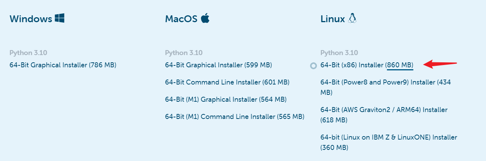

[pscan2的官方教程](http://www.pscan2sim.org/install.html)，按照下面Linux 64 bit的指示，一共分为4步。找一个地方，新建一个文件夹用来存放安装包，这里我们以 `pscan2_setup`文件夹为例。pscan2安装的位置在 `/opt/pscan2`。


###  第一步：安装Anaconda

[Anaconda官网链接](https://www.anaconda.com/products/distribution)，点进去后，翻到底。点击下面的链接，会下载一个 `Anaconda3-xxx.sh`文件，安装参考这个[教程](https://blog.csdn.net/weixin_43120985/article/details/118163799)。我这里是安装在 `/opt/Anaconda3`下，当然需要root权限。



安装好了Anaconda3后，然后创建一个python3.8的环境，这个需要和你下载的pscan2的包要求的一致。这里执行：

```
conda create -p /opt/pscan2/python38 python=3.8
```

### 第二步：安装SuiteSparse

安装这个比较复杂，因为它需要比较多的依赖。擦汗中。它是一个数值求解用的专业库，十分强大。我这里是安装的最新版的SuiteSparse，因为想着最新版的KLU的库，可以让pscan2仿真更快吧。[官方的安装链接](https://github.com/DrTimothyAldenDavis/SuiteSparse)。

这里下载的是SuiteSparse v7.0.1，[下载链接](https://github.com/DrTimothyAldenDavis/SuiteSparse/releases)。点击下面的链接，会下载一个 `SuiteSparse-xxx.tar.gz`的包。将这个包复制到 `/opt/pscan2`目录下，执行 `tar -xf SuiteSparse-xxx.tar.gz`来解压该包，会得到一个 `SuiteSparse-7.0.1`的文件夹，cd进去。我这里是采用 `make local`的方式，就是只把 `.so`文件释放到该目录下。


下面都是在root下操作。

#### 安装GMP

从[官网链接](https://gmplib.org/)下载最新安装包。

```
解压，解压后的文件夹里，INSTALL文件是教程，记得认真看。
tar -xf gmp-xxx.tar

cd gmp-xxx

使用默认配置，即默认安装在/usr/local中
./configure 

make
make check
make install
```

你的make要是提示版本太低啥的，需要升级一下cmake。我这里是把cmake升级到了3.26.1。

接下来需要安装GMP和MPFR，这两个是SuiteSparse需要的依赖。

#### 安装MPFR

这里安装的mpfr v4.0.2版本，没有安装最新版，因为我没有在官网上找到[最新版v4.2.0](https://mpfr.loria.fr/mpfr-current/)的patch文件，而找到了v4.0.2的patch文件。

v4.0.2的[下载链接](https://www.mpfr.org/mpfr-4.0.2/)。下载好后，解压，先看下里面的INSTALL说明文件。然后按照下面的指示来操作。

```
cd mpfr-4.0.2

将patch文件下载到当前目录：
wget https://www.mpfr.org/mpfr-4.0.2/allpatches

patch一下：
patch -N -Z -p1 < allpatches

./configure
make
make check

默认安装到/usr/local目录：
make install
```

安装GMP和MPFR还不是太难。

#### 安装SuiteSparse

先 `make local`，报了下面的错，但是我敲 `gcc -v`，发现我的gcc是12.2.0版本的，已经满足要求了，此时需要先指定一下gcc的环境变量。


先敲下面的代码，来指定一下gcc。[参考链接](https://github.com/Project-OSRM/osrm-backend/issues/5117)。

```
export CC=`which gcc`
export CXX=`which g++`

这里参考github官网：
CC=gcc CX=g++
```

当你指定了上面的gcc后，执行`JOBS=32 make local`，会发现还是会报那个错，如下图所示，这时发现它是卡在了GraphBLAS里。这是因为make的cache文件还没有更新，所以我们需要删除掉这个cache文件，敲 `rm GraphBLAS/build/CmakeCache.txt`，来删除掉它。


再执行`JOBS=32 make local`，会发现通过了上面这个报错。

但是过一会，又遇到了一个新的报错。说我的mpfr版本太低，但是我明明已经安装好了 v4.0.2的mpfr，所以应该时路径没有指定到位。


可以看到这次是卡在了SPEX中，在终端中执行：

```
export GMP_ROOT=/usr/local/lib/
export MPFR_ROOT=/usr/local/mpfr/

这里一定要记得删除掉上次的cache文件，不然你指定好了路径后，它还是会报相同的错误。
rm SPEX/build/CMakeCache.txt
```

这里只需要指定GMP和MPFR的root路径即可，它会自动去找的。然后再次执行 `JOBS=32 make local`。这次就没有报错了，顺利的跑完了。

这时你的lib下还是空的，还需要执行下面的命令，来生成shared libraries（.so文件）。

```
make install
```


下面我又安照pscan2官方的指示，又到各个module里make了一下。

```
cd SuiteSparse_config
make library
cd ../AMD
make library
cd ../BTF
make library
cd ../COLAMD
make library
cd ../KLU
make library
```

最后需要把SuiteSparse的lib路径添加到你的 `~/.bashrc`文件中，即在`~/.bashrc`中添加下面的内容，这样pscan2就可以找到这些.so文件了。

```
# SuiteSparse, used for pscan2
LD_LIBRARY_PATH=$LD_LIBRARY_PATH:/opt/pscan2/SuiteSparse-7.0.1/lib
export LD_LIBRARY_PATH
```

### 第三步：安装pscan2

将下载好的 `pscan2-1.0.33-py38_0.tar.bz2`包放在 `/opt/pscan2/`目录下（这里不需要解压该包），然后执行 `conda activate /opt/pscan2/python38` 来激活这个python环境。然后执行 `conda install pscan2-xx.tar.bz2`，来安装这个包。执行完后，你的`/opt/pscan2/python38/lib/python3.8/site-packages/`下就会有pscan2的包了。

### 第四步：测试安装好的pscan2

下面找一个jtl的电路，来跑一个pscan2。准备好下面几个文件，其中.hdl .cir的文件读者可以参考pscan2的手册编写，而psui.py是一个调用pscan2 GUI的脚本。


psui.py

```python
#!/usr/bin/env python
# -*- coding: utf-8 -*-

import sys, os
from PyQt5.QtWidgets import QApplication

from pscan2 import *
from pscan2.psui import PSMainWindow


if __name__ == '__main__':
    initialize([sys.argv[0],'main'])
    app = QApplication(sys.argv)
    mainWin = PSMainWindow.PSMainWindow()
    mainWin.show()
    sys.exit(app.exec_())
```

在上面这个目录下，开一个终端，先激活pscan2的python环境，`conda activate /opt/pscan2/python38 `。然后执行 `python psui.py main`来启动pscan2，此时应该会报找不到啥链接库之类的错误，我这里是报了找不到`libamd.so`，这是因为我虽然把 `/opt/pscan2/SuiteSparse-7.0.1/lib`加入到了 `~/.bashrc`文件中，但是那个`lib`库里面没有 `libamd.so`，所以它说找不到。此时只需要在 `/opt/pscan2/SuiteSparse-7.0.1/lib`中为 `libamd.so`建立软连接即可，如下图所示。每加一个 `.so`文件的软链接后，就执行一下 `python psui.py main`，它会不断报新的库的错误，然后一个一个对应添加即可。当添加完所有的以后，应该还会报 `PyQt5`啥的找不到之类的错误，这是因为你现在的 `/opt/pscan2/python38`中还没有安装这些包，所以需要一个一个来安装，装好这些包以后，应该就可以启动pscan2的GUI了。


下面是pscan2的界面，跑一下仿真，是可以运行的，也没有什么报错。


### 题外话

linux下，要格外注意 `~/.bashrc`文件。假如用户要使用这个 `/opt/pscan2`下的pscan2软件，需要在自己的 `~/.bashrc`中加入 `conda`和 `SuiteSparse库`的路径即可，conda的设置由 `conda init`自动管理的，用户不需要额外设置了，所以这里用户只需要添加下面的语句即可。

```
LD_LIBRARY_PATH=$LD_LIBRARY_PATH:/opt/pscan2/SuiteSparse-7.0.1/lib
export LD_LIBRARY_PATH
```

而 `~/.bashrc`中其他的添加都可以去掉了，不然你可能会遇到下面的报错。我这里遇到了，重装了PyQt5还是不行，[这篇博客](https://www.cnblogs.com/liushui-sky/p/13392074.html)给了我启发，应该Qt5的环境紊乱了。

```
Qt_5 not defined in file libQt5Core.so.5 with link time reference
```

在终端中执行 `locate libQt5Core.so.5`，可以看到有一堆路径中都有这个 `.so5`的包，于是我就把我的 `~/.bashrc`中其他无关的路径注释掉了，上面的报错就没有了。


有用的话，记得点个赞哟~
