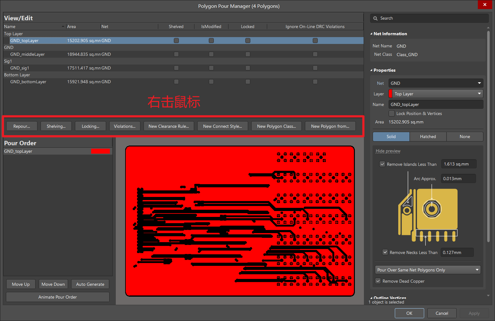

## 前言：

**环境介绍：**  AD20

**目的：**  将PCB两面都铺上GND的铜，并放置via阵列。

## 正文：

### 方式一：

当把板子都布局，布好线后，需要铺铜时，`P->G`，然后选择铺铜的区域，围绕板子四周画一个矩形，画好后，鼠标右键2下，铺铜。

铺好后手动去除板子四个角外部的铜，如下图所示，选择Polygon Pour Cutout，然后把不想要的铜圈起来即可。选中铜皮，将其设置为连接到GND net上。

上面只是铺好了top layer的铜皮，下面来铺bottom layer的。选中top layer的铜皮，ctrl+c，然后鼠标左键点击一下我们设置好的origin point，切换到bottom layer，选择special paste，然后对话框设置一下，之后再选择一次origin point即可。之后可以再按照上述方式去除一下keep out外面的死铜。当然也可以在铺铜的设置选项里勾选“去除死铜”，但是这样会把板子里面的死铜也给去除掉（一般需要去除死铜），读者根据需要来选择吧。

### 方式二：

当需要画多层板时，有时需要在每一层都铺上铜（前提是内电层是middle layer，不是plane，因为middle layer可以进行铺铜）。按照下面的方法操作：

* 先在top layer铺上铜，按快捷键`T-G-M`进入Polygon Pour Manager，在这里面批量添加铺铜，并设置各个层的Net和名称。
* 注意：放设置完每一层的Properties信息，想要Apply一下（不用点击OK)，然后再在此窗口中点击Repour操作，否则会出现自己修改完了信息，但是铺铜时发现未识别到刚修改的那一层。

### 放置via阵列：

下面开始放置一些小的via阵列，首先将“铜皮”隐藏，放置干扰我们视野。方法：ctrl+D，在view configuration窗口中隐藏Polygons。

开始放置via阵列：

先设置一下Net为GND，然后去勾选左上角的Constrain Area来选择放置的区域，根据需要设置间距，大小之类的参数。

放好via阵列的样子：

之后将铜皮取消隐藏即可，并布置丝印层。

